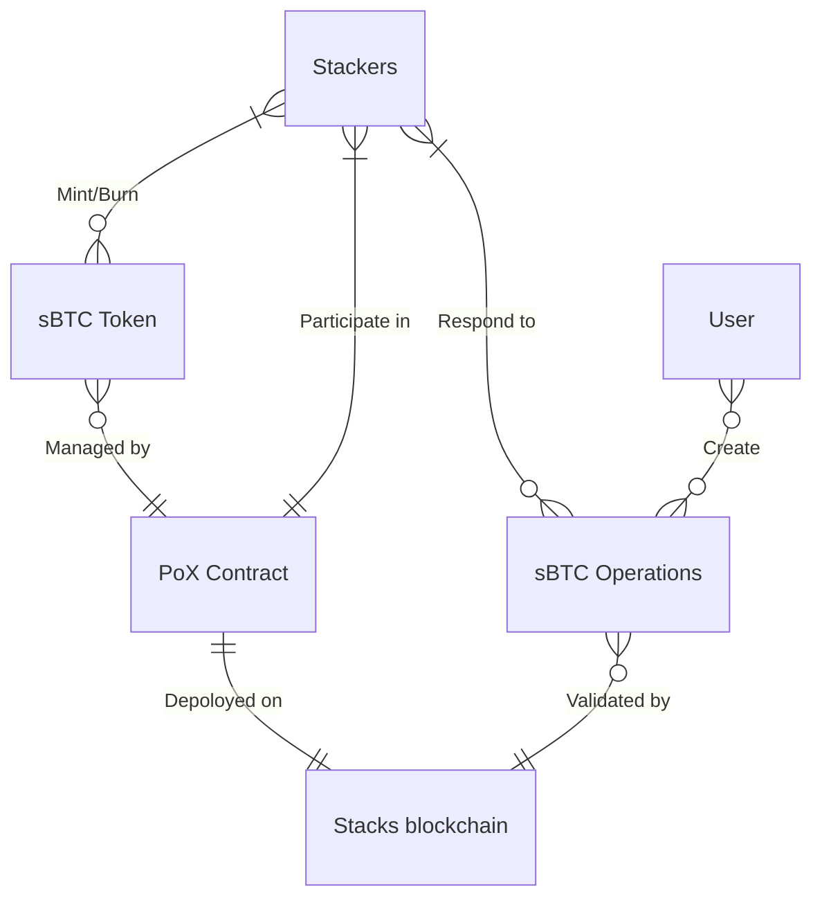

# Architecture Overview

TO REMOVE: An overview of the big-picture architecture of sBTC and all of the different components, which will be covered in detail in the rest of the chapters in this section, probably helpful to include some diagrams here.

## The sBTC Token

## The PoX Contract

## Stackers

## The Stacks blockchain

## sBTC Operations

[TODO #3](https://github.com/stacks-network/sbtc-docs/issues/3)
