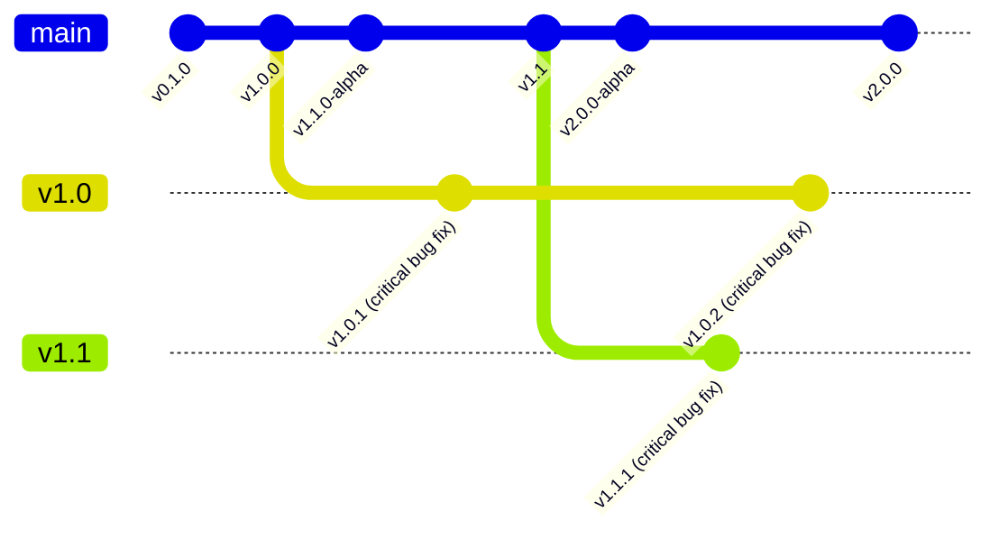
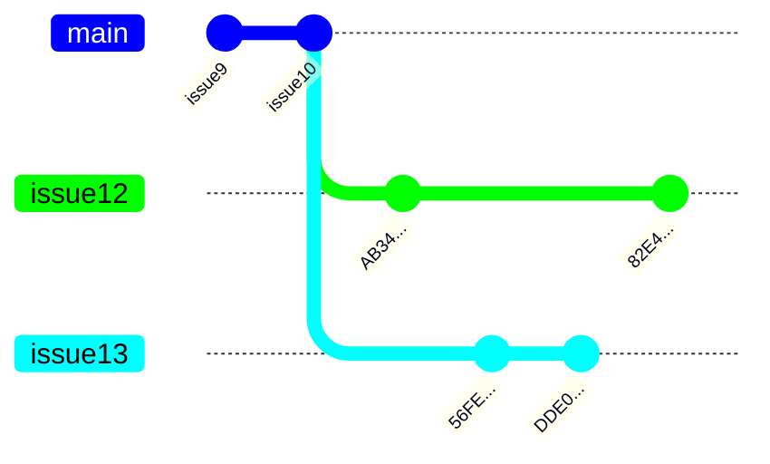
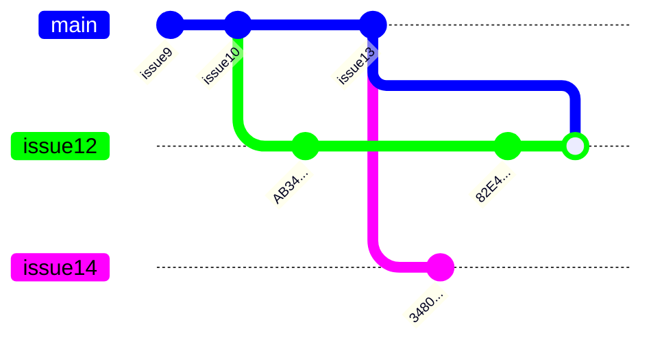
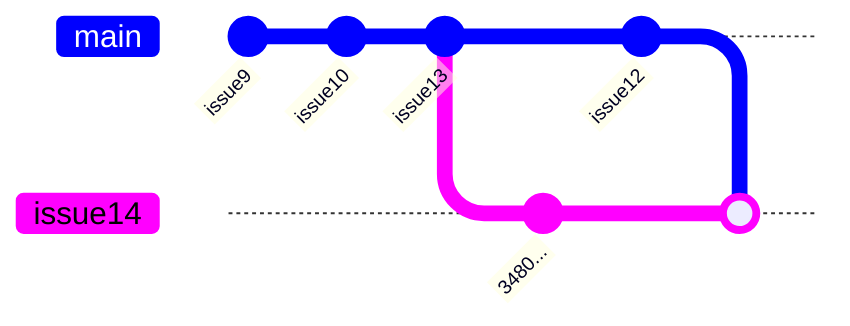

# Best Practices

## General Principles

The main principle is simplification. Please keep it simple, and don't add new unnecessaries. In particular, see [Occam's razor](https://en.wikipedia.org/wiki/Occam%27s_razor#Software_development).

### Convention Over Configuration

If you can do something without configuring, e.g., using default settings, please do. Try to avoid introducing new "better" conventions. For more details, see [convention over configuration](https://en.wikipedia.org/wiki/Convention_over_configuration). Using fewer configurations reduces information noise.

### Design Patterns And Anti-Patterns

Don't worry much about [design patterns](https://en.wikipedia.org/wiki/Software_design_pattern), but avoid [anti-patterns](https://en.wikipedia.org/wiki/Anti-pattern). If you don't use some well-known design patterns, like the [factory method](https://en.wikipedia.org/wiki/Factory_method_pattern), it's okay. However, introducing an anti-pattern, such as a [mutable singleton](https://en.wikipedia.org/wiki/Singleton_pattern#Criticism), will damage our software's quality. 

### No Direct Usage Of I/O

Please don't use direct I/O calls in libraries at all costs. You can bind direct I/O in the final application. Our libraries should never use direct I/O in the ideal world. I/O destroys deterministic behavior. Determinism is essential for testing and debugging because it allows us to reproduce behavior. If we can avoid I/O in our libraries, we can achieve 100% test coverage for them.

Try to avoid using multithreading and async programming in a library. Use simple synchronous functions which transform a state. A top-level application may decide how to bind the functions together using different techniques, such as a [thread pool](https://en.wikipedia.org/wiki/Thread_pool).

## Documentation

Use MarkDown to document a project. The GitHub MarkDown supports [Mermaid diagram](https://docs.github.com/en/get-started/writing-on-github/working-with-advanced-formatting/creating-diagrams) and [LaTeX math equations](https://docs.github.com/en/get-started/writing-on-github/working-with-advanced-formatting/writing-mathematical-expressions).

## Git Workflow

Use `main` branch as a default branch. The branch should be used for active development. Please, don't create long-lived feature branches. You may create a long-living branch to create a fix for a critical bug in an old version of a package.

For example:
- `main` - active development
- `v1.0` - bug fixes for version 1.0.
- `v1.1` - bug fixes for version 1.1.
- `v2.0` - bug fixes for version 2.0.



### Linear History And Squashed Commits

Use only squashed merge in PRs to keep the history clean and linear. The PR branch should be deleted after the merge.

Try to avoid merges between branches. Merge changes from `main` into your branch instead. Multiple small atomic PRs are preferred to a single large PR. This will help to avoid merge conflicts and make the review process easier.

For Example:

We are working on `issue12` and `issue13`:


Then, `issue13` PR is merged, and we are working on `issue14`:

      
After that, `issue12` PR is merged, and we are working on `issue14`:


## Rust Conventions

To use the convention over configuration principle in Rust, see [project layout](https://doc.rust-lang.org/cargo/guide/project-layout.html).

Don't create an executable package. Always create a library package `cargo new --lib {library-name}`. If you need an executable, use an existing library and create an executable in `{library-name}/src/bin`. 

A library source code should avoid direct usage of I/O. An executable from `src/bin` should only bind I/O to a library, and all other logic should be in a library. A library name should match a directory name.

Always use workspace dependencies. This way, we can ensure we don't have [diamond dependency problem](https://en.wikipedia.org/wiki/Dependency_hell#Problems).

Use `--release` for testing and deploying, `cargo build --release`, `cargo test --release`. We don't need to test binaries that we will not ship, such as `debug` binaries.

### Rust Documentation

Every Rust package should have a README.md file. This README.md file is also used to generate a front page for a crate when published on https://crates.io/. The README.md should contain instructions on how to build, test, and run the package and prerequisites if needed. Rust supports examples in comments. Please provide comments with correct examples. Use `cargo test --doc` to run the examples as tests. Use `cargo doc --open` to generate documentation and open it in a browser.

### Example Of A Rust Workspace With Multiple Packages

```
- a\
  - src\
    - bin\
      - a.rs
    - lib.rs
- b\
  - src\
    - bin\
      - b.rs
    - lib.rs
- Cargo.toml
```

- `Cargo.toml`
  ```toml
  [workspace]
  members = ["a", "b"]
  [workspace.dependencies]
  serde = "1.0"
  ```
- `a\Cargo.toml`
  ```toml
  [package]
  name = "a"
  # ...
  [dependencies]
  serde.workspace = true
  ```
- `b\Cargo.toml`
  ```toml
  [package]
  name = "b"
  # ...
  [dependencies]
  a.path = "../a"
  serde.workspace = true
  ```

