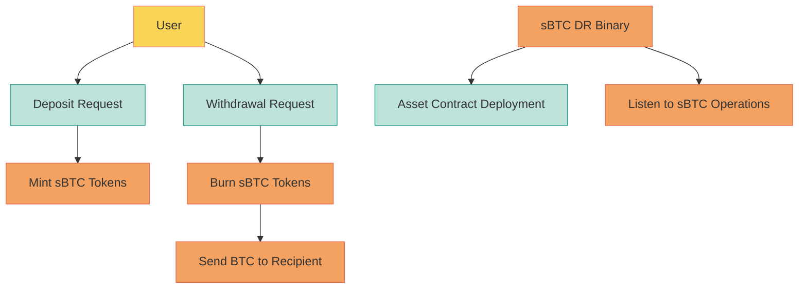
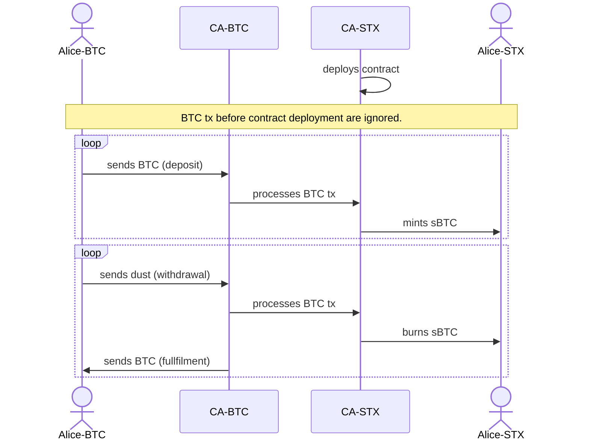

# sBTC Developer Release (0.1)

The sBTC Developer Release (sBTC DR) facilitates the complete deposit and withdrawal processes of sBTC, simulating the core mechanics of the sBTC system in the form of a singular service.

This release includes an asset contract alongside a dedicated binary. Primarily designed for use on testnet or local development networks. While it's technically possible for anyone to deploy the sBTC DR on the mainnet, it's not recommended due to its developmental nature.

Upon activation, the sBTC DR binary takes charge: it deploys the asset contract and actively monitors sBTC operations. When a deposit request comes in, the system mints the corresponding sBTC tokens to the specified address. Similarly, upon a withdrawal request, it burns the requisite sBTC tokens and promptly processes the withdrawal, transferring the designated BTC amount to the intended recipient.

## sBTC Developer release reference implementation plan

The reference implementation of the sBTC developer release, codenamed Alpha Romeo, is currently under implementation in [this repository](https://github.com/stacks-network/sbtc/tree/master/romeo).
Every piece of functionality that is being worked on is formulated as [issues](https://github.com/stacks-network/sbtc/issues) with the [sBTC DR] prefix and `alpha-romeo` label.

For anyone interested in tracking the high-level progress of the Alpha Romeo work, these key issues should provide a good view in how things are progressing.

1. Implement the deposit flow [#67](https://github.com/stacks-network/sbtc/issues/67)
2. Implement the withdrawal flow [#68](https://github.com/stacks-network/sbtc/issues/68)
3. Containerize and deploy the release [#85](https://github.com/stacks-network/sbtc/issues/85)
4. Ensure the bridge is compatible with the latest release [#86](https://github.com/stacks-network/sbtc/issues/86)
5. Write developer docs for the release [#77](https://github.com/stacks-network/sbtc-docs/issues/77)

The sBTC contract will be deployed on the Stacks testnet by an address that is still to be defined. See [sbtc/#178](https://github.com/stacks-network/sbtc/issues/178).

In sBTC 0.1, the deposit and withdrawal transactions are processed by a central authority (CA). The flow is as follows:

## Web app

A web interface for the sBTC contract is available at https://bridge.stx.eco/?net=testnet

The web app allows to deposit and withdraw btc from the peg wallet. It also provides a list of recent deposit and withdrawal transactions.

## sBTC cli

See [README of the sbtc repo](https://github.com/stacks-network/sbtc/blob/main/sbtc-cli/README.md) for commands to create and broadcast deposit and withdrawal bitcoin transactions.

## sBTC API

There is a public API server for the most common tasks in the context of sBTC. Developers can use this API create deposit and withdrawal request, get information about btc transactions, etc.

Documention is available at [bridge.sbtc.tech](https://bridge.sbtc.tech/bridge-api/docs/).

## sBTC SDK

stacks.js has added support for sBTC deposit and withdrawal requests. Current work in progress can be seen at [stacks.js/feat/add-sbtc-contracts](https://github.com/hirosystems/stacks.js/pull/1554).
