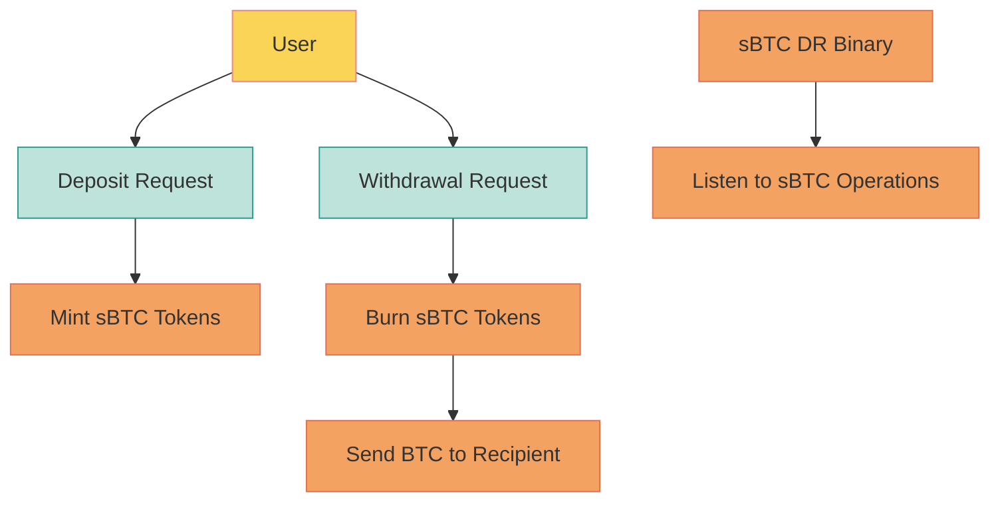

# sBTC Developer Release (0.1)
The sBTC Developer Release (sBTC DR) facilitates the complete deposit and withdrawal processes of sBTC, simulating the core mechanics of the sBTC system in the form of a singular service.

This release includes an asset contract alongside a dedicated binary. Primarily designed for use on testnet or local development networks. While it's technically possible for anyone to deploy the sBTC DR on the mainnet, it's not recommended due to its developmental nature.

Upon activation, the sBTC DR binary takes charge: it deploys the asset contract and actively monitors sBTC operations. When a deposit request comes in, the system mints the corresponding sBTC tokens to the specified address. Similarly, upon a withdrawal request, it burns the requisite sBTC tokens and promptly processes the withdrawal, transferring the designated BTC amount to the intended recipient.

