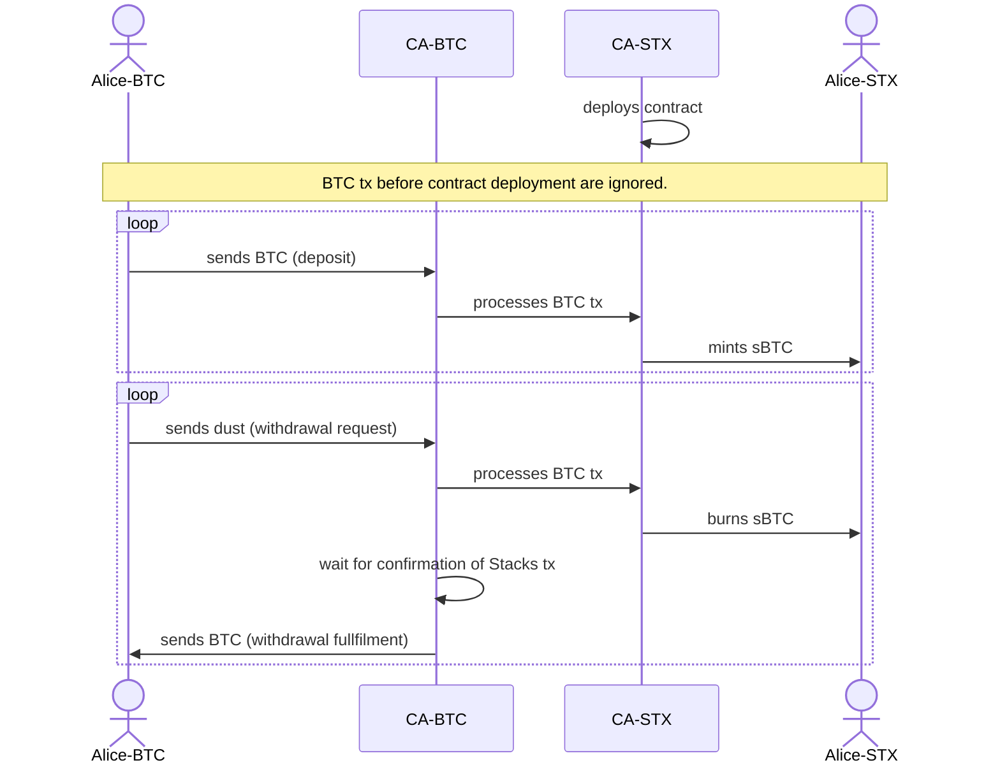

# Get Started with sBTC 0.1

The sBTC contract will be deployed on the Stacks testnet by an address that is still to be defined. See [sbtc/#178](https://github.com/stacks-network/sbtc/issues/178).

In sBTC 0.1, the deposit and withdrawal transactions are processed by a central authority (CA). The flow is as follows:

## Web app
A web interface for the sBTC contract is available at [https://bridge.stx.eco/?net=testnet](https://bridge.stx.eco/?net=testnet)

The web app allows to deposit and withdraw btc from the peg wallet. It also provides a list of recent deposit and withdrawal transactions.

The settings page provides details about the sBTC contract and your own addresses.

## sBTC cli

See [README of the sbtc repo](https://github.com/stacks-network/sbtc/blob/main/sbtc-cli/README.md) for commands to create and broadcast deposit and withdrawal bitcoin transactions.

## sBTC API

There is a public API server for the most common tasks in the context of sBTC. Developers can use this API create deposit and withdrawal request, get information about btc transactions,  etc.

Documention is available at [bridge.sbtc.tech](https://bridge.sbtc.tech/bridge-api/docs/).

## sBTC SDK

stacks.js has added support for sBTC deposit and withdrawal requests. Current work in progress can be seen at [stacks.js/feat/add-sbtc-contracts](https://github.com/hirosystems/stacks.js/pull/1554).