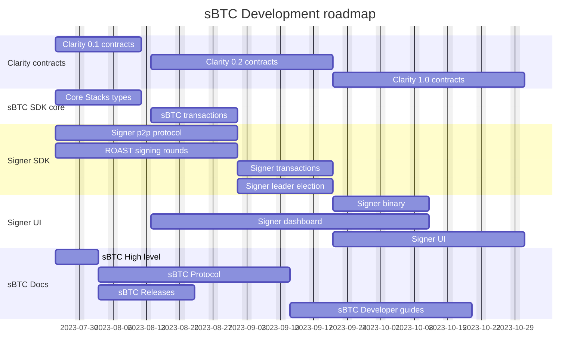

# sBTC Roadmap

TODO: Break down releases into their main components, outline their dependencies and create a gantt chart of how the work plan forward for sBTC is intended to look.

## Clarity 0.1 contracts

## Clarity 0.2 contracts

## Clarity 1.0 contracts

## Core Stacks types

## sBTC Transactions

## Signer p2p protocol

## ROAST signing rounds

## Signer transactions

## Signer leader election

## Signer binary

## Signer dashboard

## Signer UI

## sBTC High level

## sBTC Protocol

## sBTC Releases

## sBTC Developer guides

-------- TODO: Remove below here

## Clarity
- Barebones contracts (pretty darn close! - end of August)
  - Signer running, can do handoff and do deposits and withdrawals.
  - No incentives, assume good behavior.
  - Only on testnet.
  - Assume signers are trustworthy and play nice. Users play nice.

- Developer release v2 contracts (? - end of September)
  - Assume signers play nice, but users can do anything.

- Nakamoto release contracts ( - end of November)

### Dependencies
- Updated test vectors

### Misc
"Developer preview"
- How much tokenomics should be a concern for the clarity group?
- Withdrawals initiated on Stacks - makes a lot of things easier.

----------------------------

- First draft of contracts
  - Asset contract
  - Deposit processor
  - Withdrawal processor
  - Handoff contract
  - Stacking pool contract
  - Bootstrap contract
- Deploy draft contracts to testnet

- Barebones contracts
- Developer release contracts
- Nakamoto contracts

## Signer
- API mockups
- Signer Network protocol
- PSBT Signing
- Initiating fulfillments
- Initiating handoff
- Auto-deny / configuration
- Reveal deposit
- Reveal withdrawal

- FIRE Ready
  - Documentation / library implementation

- Signer Binary
  - Integrate API
  - Use SDK
  - Implement "coordinator logic"

- Signer networking solution

- Signer integration tests

- Signer dashboard
- Signer web client
- Delegated signing

## Documentation

## SDK
- Stacks core migration
- sBTC transactions and wire formats (parsing and writing)
- Commit-reveal functionality

- Signer SDK
  - Part of sBTC SDK (sync with Stjepan)
  - Initiate signer
  - Set signer configuration
  - Get pending transactions
  - Sign transaction
    - Validate transactions to sign
  - Initiate signing round
