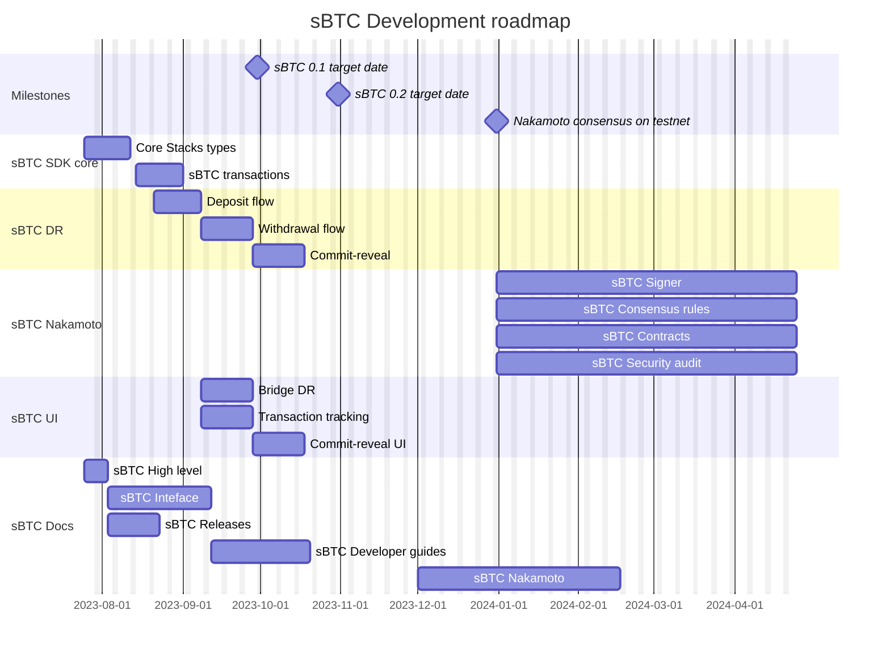

# sBTC Technical Roadmap
Welcome to the technical roadmap for sBTC, a comprehensive guide that will help you understand our goals, timelines, and the journey we're embarking on to bring our product to life. This roadmap is a dynamic document and we will continually update it as we achieve key milestones and refine our plans.

Each effort in the roadmap represents a key aspect of our development process. The following sections provide more detail about what we aim to achieve with each effort.

## Milestones
These target dates represent the aimed releases as defined in [sBTC Releases](sbtc-releases.md).
## sBTC SDK Core

### Core Stacks types
This phase of development is dedicated to implementing the fundamental types that sBTC developers require to interact effectively with the Stacks blockchain. With these key primitives in place, developers should be fully equipped to construct arbitrary Stacks transactions, establish connections with Stacks nodes, broadcast their transactions, and monitor the status of these transactions on the blockchain.

### sBTC Transactions
In this next phase, our goal is to furnish a comprehensive toolkit for creating and decoding all sBTC-specific transactions on both the Bitcoin and Stacks blockchains. This toolkit is designed to streamline the process of constructing sBTC operations in either OP_RETURN or commit-reveal format to Bitcoin, as well as initiating contract calls to sBTC contract functions on the Stacks blockchain. This development will allow developers to engage with sBTC operations with ease and efficiency.

## sBTC DR

### Deposit flow
The first part of implementing the [sBTC Developer Release](./sbtc-releases/sbtc-dev.md) is to provide a working deposit flow end to end. Once this effort is done, we will have implemented a system capable of monitoring bitcoin testnet for [deposit request transactions](./sbtc-operations/bitcoin-transactions.md). The system responds to these transactions by minting sBTC in a dedicated asset contract, which is also bundled with the developer release.

### Withdrawal flow
Once the deposit flow is implemented, the next effort is to ensure withdrawals work end-to-end. This effort is to implement and test that the sBTC DR system is capable of monitoring bitcoin testnet for [withdrawal request transactions](./sbtc-operations/bitcoin-transactions.md). The system responds to these transactions by burning sBTC in the DR asset contract, and subsequently transferring bitcoin to the requested recipient as a fulfillment transaction.

### Commit-reveal
When deposits and withdrawals work end to end, the first version of the developer release is done. This should be promptly followed by an upgraded version supporting both flows with commit-reveal operations. This version should be able to monitor bitcoin testnet for revealed deposit and withdrawal request transactions. Moreover, the version should also provide a revealer implementation where clients can provide the commit witness script and address allowing the developer release system to reveal the committed transaction.

## sBTC Nakamoto

## sBTC Docs

### sBTC High Level
The high-level sBTC documentation serves to align understanding around the purpose, structure, and components of sBTC. It will offer a bird's eye view of the project, setting the stage for more detailed exploration of specific elements in subsequent sections. This should be the starting point for anyone seeking to gain a basic understanding of what sBTC is and its role within the broader ecosystem.

### sBTC Protocol
The sBTC protocol documentation is designed to act as the definitive guide to the sBTC protocol. It will encompass all the requisite details for a comprehensive understanding of its operation, the economic trade-offs involved, and the measures taken to secure the protocol. This document should be thorough enough to serve as a reference for alternative implementations of the protocol, ensuring accurate replication of its design and function.

### sBTC Releases
The sBTC release documentation is a pivotal resource, fostering an understanding of the developmental strides leading up to the full implementation of the sBTC protocol. This section should detail the various releases we've made, drawing attention to how they deviate from the final protocol. It's essential to highlight the simplifications or assumptions each release is predicated on and elucidate why we've chosen to adopt these steps in our development process.

### sBTC Developer Guides
Our developer guides aim to provide a developer-friendly overview of the tools, SDKs, and functionalities offered in the sBTC reference implementation and various releases. These guides are designed to help developers understand and build applications using sBTC, fostering creativity and innovation within the ecosystem. The ultimate goal is to ensure developers can effectively contribute to the growth and diversification of the ecosystem using the sBTC platform.
