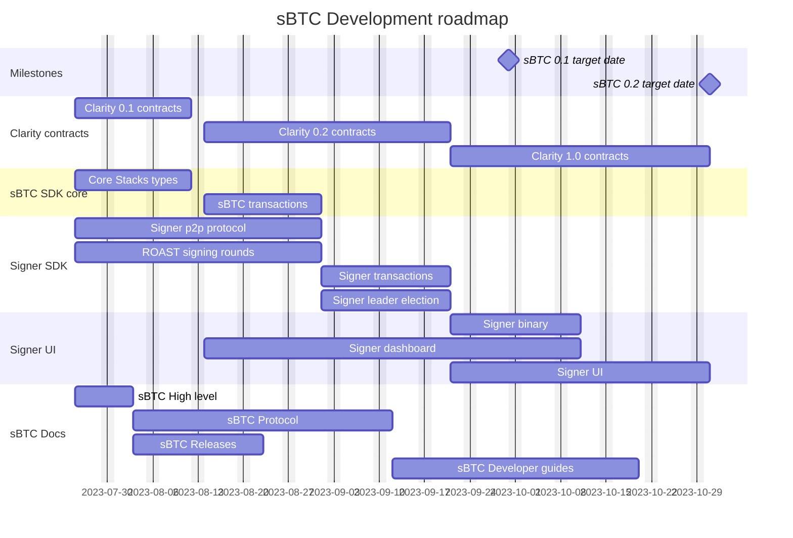

# sBTC Technical Roadmap
Welcome to the technical roadmap for sBTC, a comprehensive guide that will help you understand our goals, timelines, and the journey we're embarking on to bring our product to life. This roadmap is a dynamic document and we will continually update it as we achieve key milestones and refine our plans.

Each effort in the roadmap represents a key aspect of our development process. The following sections provide more detail about what we aim to achieve with each effort.

## Milestones
These target dates represent the aimed releases as defined in [sBTC Releases](sbtc-releases.md).

## Clarity Contracts

### Clarity 0.1 contracts
The primary aim of this phase is to establish a robust foundation for sBTC by deploying the inaugural set of contracts for the 0.1 release. These contracts are designed to support the entire user flow and signer flow, as delineated in [sBTC 0.1](sbtc-dev.md). An important aspect to note about this set of contracts is the inherent assumption of good faith - we assume that both users and signers will engage honestly and ethically. Consequently, the system's liveliness could be compromised by user actions, and there are no economic incentives in place to ensure signers' appropriate maintenance of the sBTC wallet.

### Clarity 0.2 contracts
Expanding upon the groundwork laid in the 0.1 phase, this subsequent set of contracts enhances the system's security by eliminating potential threats from regular users to the system's liveliness. Although this release provides significant security improvements, it still operates under the assumption that signers act benevolently, as there remains no economic incentive for them to ensure proper behavior.

### Clarity 1.0 contracts
Our 1.0 contracts aim to offer the complete functionality necessary for the consensus-breaking 1.0 release. In this significant stage, the Stacks consensus rules will introduce economic incentives for signers to properly maintain the sBTC wallet. This development reduces the need for trust in the signers, adding an extra layer of security and reliability to the system.

## sBTC SDK Core

### Core Stacks types
This phase of development is dedicated to implementing the fundamental types that sBTC developers require to interact effectively with the Stacks blockchain. With these key primitives in place, developers should be fully equipped to construct arbitrary Stacks transactions, establish connections with Stacks nodes, broadcast their transactions, and monitor the status of these transactions on the blockchain.

### sBTC Transactions
In this next phase, our goal is to furnish a comprehensive toolkit for creating and decoding all sBTC-specific transactions on both the Bitcoin and Stacks blockchains. This toolkit is designed to streamline the process of constructing sBTC operations in either OP_RETURN or commit-reveal format to Bitcoin, as well as initiating contract calls to sBTC contract functions on the Stacks blockchain. This development will allow developers to engage with sBTC operations with ease and efficiency.

## Signer SDK

### Signer p2p protocol
This protocol is key because...

### ROAST signing rounds
ROAST signing rounds will provide...

### Signer transactions
The goal here is to...

### Signer leader election
With this feature, we aim to...

## Signer UI

### Signer binary
This component is critical as...

### Signer dashboard
Our dashboard will...

### Signer UI
The aim with the Signer UI is to...

## sBTC Docs

### sBTC High level
The high-level documentation will provide...

### sBTC Protocol
Understanding the sBTC Protocol is essential as...

### sBTC Releases
Our release documentation is crucial for...

### sBTC Developer guides
Our developer guides are aimed at...

-------- TODO: Remove below here

## Clarity
- Barebones contracts (pretty darn close! - end of August)
  - Signer running, can do handoff and do deposits and withdrawals.
  - No incentives, assume good behavior.
  - Only on testnet.
  - Assume signers are trustworthy and play nice. Users play nice.

- Developer release v2 contracts (? - end of September)
  - Assume signers play nice, but users can do anything.

- Nakamoto release contracts ( - end of November)

### Dependencies
- Updated test vectors

### Misc
"Developer preview"
- How much tokenomics should be a concern for the clarity group?
- Withdrawals initiated on Stacks - makes a lot of things easier.

----------------------------

- First draft of contracts
  - Asset contract
  - Deposit processor
  - Withdrawal processor
  - Handoff contract
  - Stacking pool contract
  - Bootstrap contract
- Deploy draft contracts to testnet

- Barebones contracts
- Developer release contracts
- Nakamoto contracts

## Signer
- API mockups
- Signer Network protocol
- PSBT Signing
- Initiating fulfillments
- Initiating handoff
- Auto-deny / configuration
- Reveal deposit
- Reveal withdrawal

- FIRE Ready
  - Documentation / library implementation

- Signer Binary
  - Integrate API
  - Use SDK
  - Implement "coordinator logic"

- Signer networking solution

- Signer integration tests

- Signer dashboard
- Signer web client
- Delegated signing

## Documentation

## SDK
- Stacks core migration
- sBTC transactions and wire formats (parsing and writing)
- Commit-reveal functionality

- Signer SDK
  - Part of sBTC SDK (sync with Stjepan)
  - Initiate signer
  - Set signer configuration
  - Get pending transactions
  - Sign transaction
    - Validate transactions to sign
  - Initiate signing round
