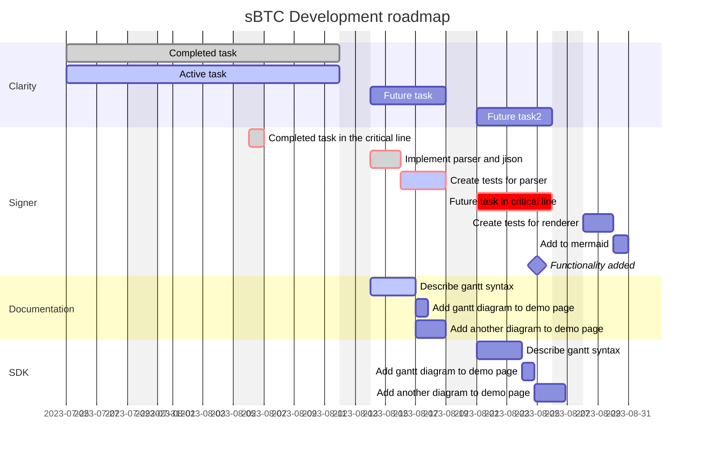

# sBTC Roadmap

TODO: Break down releases into their main components, outline their dependencies and create a gantt chart of how the work plan forward for sBTC is intended to look.

## Clarity
- First draft of contracts
  - Asset contract
  - Deposit processor
  - Withdrawal processor
  - Handoff contract
  - Stacking pool contract
  - Bootstrap contract
- Deploy draft contracts to testnet

- Barebones contracts
- Developer release contracts
- Nakamoto contracts

## Signer
- API mockups
- Signer Network protocol
- PSBT Signing
- Initiating fulfillments
- Initiating handoff
- Auto-deny / configuration
- Reveal deposit
- Reveal withdrawal

## Documentation

## SDK
- Stacks core migration
- sBTC transactions and wire formats (parsing and writing)
- Commit-reveal functionality
